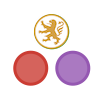

# LyonCalcul.jl

[Talk in Lyon for Julia Day January 31th 2019](docs/src/slides.md)

This is a presentation about how to develop a Julia package.
If you are interested in Julia packages, I suggest you take a look at [PkgTemplates](https://github.com/invenia/PkgTemplates.jl).
